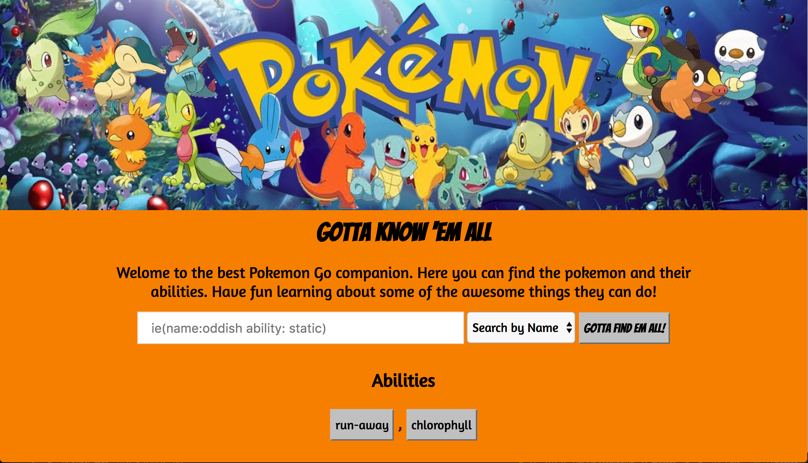
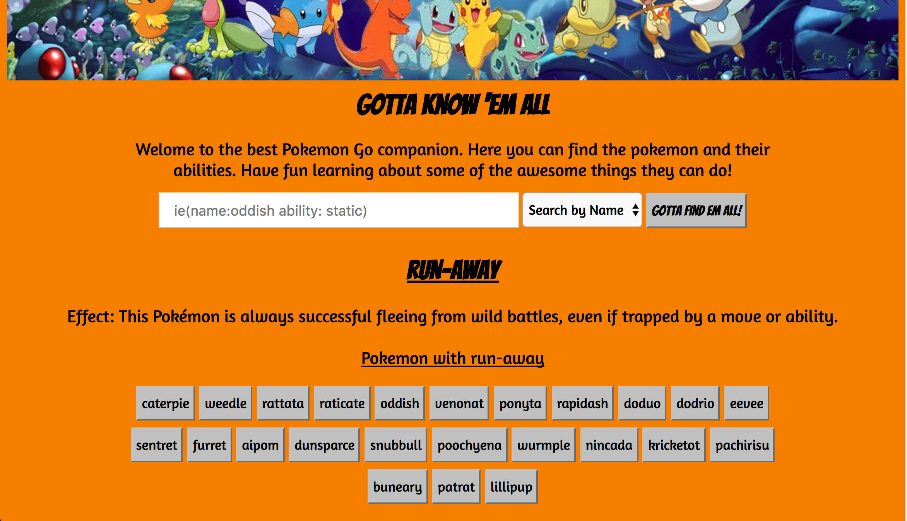
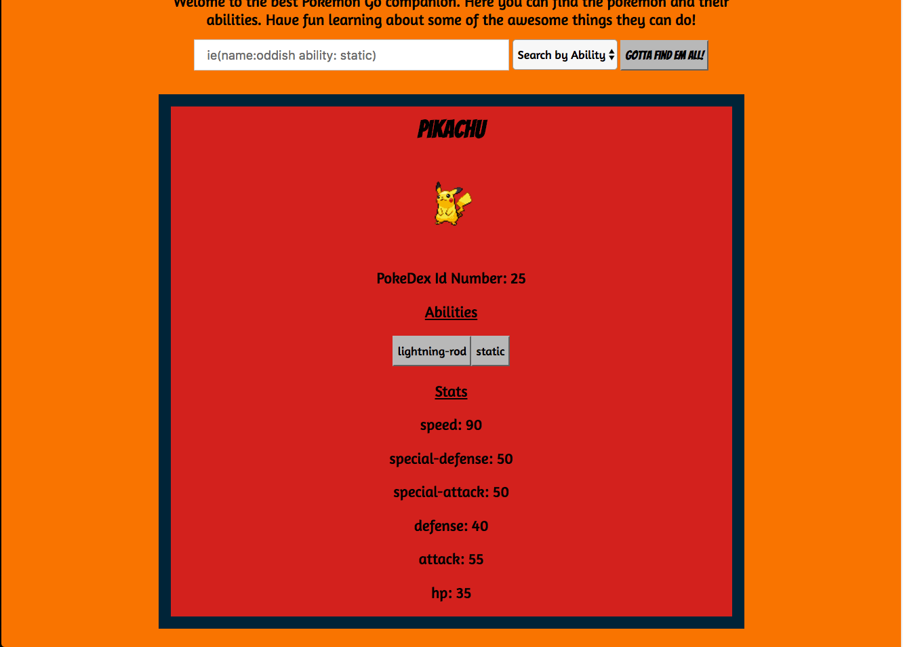

# Gotta Know 'Em All
Gotta Know 'Em All is an app gives you inforamtion about every Pokemon. It allows you to search a Pokemon or a Pokemon’s ability. If you search a Pokemon's ability you will be shown a description of the ability.If you search a Pokemon's name you will be shown information on the Pokemon.

## Technology Used
FrontEnd: CSS, JavaScript, Jquery, PokiApi  
Development Tools: Chrome Developer Tools

##ScreenShots

#### Start Page  
 

#### Search By Pokemon Name  
 

#### Search By Pokemon Ability or Click on an ability  
 

#### Click on Pokemon  
 

## Deployment
[Check it out here](https://patricewhite.github.io/Capstone-Paton-Patrice/)
